# MQL Language Server — Architecture

Generated from GitNexus knowledge graph (2607 nodes, 5664 edges, 89 clusters, 153 processes).

## Overview

LSP 3.17 implementation for **MQL4** (MetaTrader 4) targeting **.NET 10.0**. Source parsing is delegated to **ANTLR 4.13.1** via a formal grammar (`Mql4Grammar.g4`), with the generated lexer/parser/visitor living under `src/Parser/Generated/`. The server speaks JSON-RPC over stdio through a custom `LspStreamMiddleware`, then dispatches requests to **27 specialized `*Handler` classes** under `src/Lsp/Handlers/`. State is held in two hot structures — `OpenDocumentStore` (per-document buffers) and `GlobalSymbolIndex` (cross-file symbol map) — with `MetricsCollector` and `PerformanceMonitor` providing observability and a `BaselineBenchmark` test pinning perf budgets in CI.

**Stack:** .NET 10.0 · LSP 3.17 · ANTLR 4.13.1 · Antlr4BuildTasks 12.10

**Entry point:** `src/Program.cs` → `LspStreamMiddleware` → `Mql4LspServer`.

## Functional Areas

Detected as Leiden communities over the call graph. Symbols = AST nodes (functions, classes, methods, fields) inside the cluster.

| Area | Symbols | Cohesion (max) | Responsibility |
|---|---:|---:|---|
| **Parser** | ~286 | 0.67 | ANTLR-driven parse pipeline, macro pre-processing, symbol index, AST visitor. Hub: `src/Parser/Mql4AntlrParser.cs`. |
| **Lsp** | ~163 | 0.81 | Transport, server capabilities, request/response shaping, JSON-RPC plumbing. |
| **Handlers** | ~158 | 0.98 | 27 LSP request handlers under `src/Lsp/Handlers/` (one per feature: `Completion`, `Definition`, `References`, `Hover`, `Rename`, `SemanticTokens`, `CodeAction`, `Formatting`, etc.). |
| **Server** | ~30 | 0.59 | `Mql4LspServer` orchestration + stateful services (`OpenDocumentStore`, `GlobalSymbolIndex`, `MetricsCollector`, `PerformanceMonitor`, `CorrelationIdProvider`, `Mql4ServerCapabilities`). |
| **Performance** | ~50 | 0.92 | `BaselineBenchmark` + perf/memory tests in `tests/Performance/`. |
| **Tests** (parser/LSP/cross-file) | — | — | `tests/Parser/`, `tests/Lsp/`, `tests/CrossFile/`, `tests/Performance/`. |

**Cross-cutting domain model:** `src/Models/` (`Mql4File`, `Symbol`, `SymbolKind`) and `src/Mql4/Builtins/Mql4Builtins.cs` (built-in MQL4 functions/types).

## Architecture Diagram

```mermaid
flowchart TB
    Client[Editor / IDE] <-->|JSON-RPC over stdio| Middleware[LspStreamMiddleware]

    subgraph Entry
        Program[Program.cs]
        Middleware
    end

    Program --> Middleware
    Middleware --> Server[Mql4LspServer]

    subgraph ServerCore["Server Core (src/Lsp/Server)"]
        Server --> Caps[Mql4ServerCapabilities]
        Server --> Store[OpenDocumentStore]
        Server --> Index[GlobalSymbolIndex]
        Server --> Metrics[MetricsCollector]
        Server --> PerfMon[PerformanceMonitor]
        Server --> CorrId[CorrelationIdProvider]
    end

    subgraph Handlers["LSP Handlers (src/Lsp/Handlers, 27)"]
        H_Completion[CompletionHandler]
        H_Definition[DefinitionHandler]
        H_Declaration[DeclarationHandler]
        H_References[ReferencesHandler]
        H_Hover[HoverHandler]
        H_Rename[RenameHandler]
        H_DocumentSymbol[DocumentSymbolHandler]
        H_SemanticTokens[SemanticTokensHandler]
        H_Diagnostic[DiagnosticHandler]
        H_CodeAction[CodeActionHandler]
        H_Formatting[DocumentFormattingHandler]
        H_SignatureHelp[SignatureHelpHandler]
        H_DidOpen[DidOpenTextDocumentHandler]
        H_DidChange[DidChangeTextDocumentHandler]
        H_DidSave[DidSaveTextDocumentHandler]
        H_DidClose[DidCloseTextDocumentHandler]
        H_Moniker[MonikerHandler]
        H_Implementation[ImplementationHandler]
        H_TypeDefinition[TypeDefinitionHandler]
        H_InlayHint[InlayHintHandler]
        H_FoldingRange[FoldingRangeHandler]
        H_SelectionRange[SelectionRangeHandler]
        H_DocumentHighlight[DocumentHighlightHandler]
        H_RangeFormatting[RangeFormattingHandler]
        H_OnTypeFormatting[OnTypeFormattingHandler]
        H_CodeActionResolve[CodeActionResolveHandler]
        H_WorkspaceSymbol[WorkspaceSymbolHandler]
    end

    Server --> Handlers

    H_DidOpen --> Store
    H_DidOpen --> Index
    H_DidChange --> Store
    H_DidChange --> Index
    H_DidSave --> Store
    H_DidSave --> Index

    H_Definition --> Parser
    H_Declaration --> Parser
    H_References --> Parser
    H_Hover --> Parser
    H_Rename --> Parser
    H_DocumentSymbol --> Parser
    H_SemanticTokens --> Parser
    H_Completion --> Parser
    H_Formatting --> Parser
    H_SignatureHelp --> Parser

    subgraph ParserPipeline["Parser Pipeline (src/Parser)"]
        Parser[Mql4AntlrParser]
        Generated["ANTLR Generated (Lexer/Parser/Visitor)"]
        Visitor[Mql4SymbolVisitor]
        MacroOpt[ParseMacroNameOptimized]
    end

    Parser --> Generated
    Generated --> Visitor
    Parser --> MacroOpt
    Parser --> Index

    subgraph Domain["Domain (src/Models, src/Mql4)"]
        Mql4File[Mql4File]
        Symbol[Symbol]
        SymbolKind[SymbolKind]
        Builtins[Mql4Builtins]
        Grammar[Mql4Grammar.g4]
    end

    Visitor --> Mql4File
    Visitor --> Symbol
    Parser --> Builtins
    Grammar -.generates.-> Generated

    subgraph Perf["Performance (tests/Performance)"]
        Bench[BaselineBenchmark]
    end

    PerfMon -.metrics.-> Metrics
    Bench -.asserts.-> PerfMon
```



## Key Execution Flows

The 5 most architecturally significant processes (ranked by reach and cross-community fan-out, not just step count).

### 1. MQL4 file parsing with macro optimization — 6 steps

`ParseFileWithIncludes → ParseMacroNameOptimized` (communities: `comm_46`, `comm_45`, `comm_50`)

The public entry point of the parser. Resolves `#include` directives, runs the ANTLR-generated parser, extracts preprocessor macros, and optimizes macro references.

| # | Symbol | File |
|---|---|---|
| 1 | `Mql4AntlrParser.ParseFileWithIncludes` | `src/Parser/Mql4AntlrParser.cs` |
| 2 | `Mql4AntlrParser.ParseFileWithIncludes` (recursion step) | `src/Parser/Mql4AntlrParser.cs` |
| 3 | `Mql4AntlrParser.ParseFileFromPath` | `src/Parser/Mql4AntlrParser.cs` |
| 4 | `Mql4AntlrParser.ParseFile` | `src/Parser/Mql4AntlrParser.cs` |
| 5 | `Mql4AntlrParser.ExtractMacros` | `src/Parser/Mql4AntlrParser.cs` |
| 6 | `Mql4AntlrParser.ParseMacroNameOptimized` | `src/Parser/Mql4AntlrParser.cs` |

### 2. LSP definition/declaration/references → symbol index — 5 steps

`Handle → CreateSymbolIndex` (communities: `comm_6`, `comm_5`, `comm_47`)

Three handlers (`DefinitionHandler`, `DeclarationHandler`, `ReferencesHandler`) converge on the same lookup pipeline. The parser lazily builds a cross-file symbol index on first miss, then reuses it.

| # | Symbol | File |
|---|---|---|
| 1 | `*.Handle` (Definition / Declaration / References) | `src/Lsp/Handlers/*Handler.cs` |
| 2 | `Mql4AntlrParser.FindSymbolDefinition` | `src/Parser/Mql4AntlrParser.cs` |
| 3 | `Mql4AntlrParser.FindSymbolsByName` | `src/Parser/Mql4AntlrParser.cs` |
| 4 | `Mql4AntlrParser.EnsureSymbolIndex` | `src/Parser/Mql4AntlrParser.cs` |
| 5 | `Mql4AntlrParser.CreateSymbolIndex` | `src/Parser/Mql4AntlrParser.cs` |

### 3. Document sync → global symbol index — 3 steps, 3 entry handlers

`Handle → SymbolLocation` (Server community)

Every text-document change (`DidOpen`, `DidChange`, `DidSave`) feeds the in-memory `GlobalSymbolIndex`, which is the read-side complement to the parser's `CreateSymbolIndex`. Keeps cross-file navigation correct as files are edited.

| # | Symbol | File |
|---|---|---|
| 1 | `*.Handle` (DidOpen / DidChange / DidSave) | `src/Lsp/Handlers/Did*Handler.cs` |
| 2 | `GlobalSymbolIndex.AddFile` | `src/Lsp/Server/GlobalSymbolIndex.cs` |
| 3 | `GlobalSymbolIndex.SymbolLocation` | `src/Lsp/Server/GlobalSymbolIndex.cs` |

### 4. Parse → AST visitor (symbol extraction) — 5 steps

`ParseFileWithIncludes → Mql4SymbolVisitor` (communities: `comm_46`, `comm_45`)

After ANTLR produces the parse tree, `Mql4SymbolVisitor` walks it to extract functions, variables, parameters, and includes into `Mql4File`/`Symbol` models.

| # | Symbol | File |
|---|---|---|
| 1 | `Mql4AntlrParser.ParseFileWithIncludes` | `src/Parser/Mql4AntlrParser.cs` |
| 2 | `Mql4AntlrParser.ParseFileWithIncludes` (recursion step) | `src/Parser/Mql4AntlrParser.cs` |
| 3 | `Mql4AntlrParser.ParseFileFromPath` | `src/Parser/Mql4AntlrParser.cs` |
| 4 | `Mql4AntlrParser.ParseFile` | `src/Parser/Mql4AntlrParser.cs` |
| 5 | `Mql4SymbolVisitor` (constructor / walk) | `src/Parser/Mql4AntlrParser.cs` |

### 5. Performance baseline benchmark — 5 steps

`Baseline_BenchmarkAllOperationsAsync → ExecuteCommand` (communities: `comm_82`, `comm_81`)

CI-facing benchmark. Detects the host environment and power state (battery vs. mains) before timing LSP operations, so perf numbers are comparable across machines.

| # | Symbol | File |
|---|---|---|
| 1 | `BaselineBenchmark.Baseline_BenchmarkAllOperationsAsync` | `tests/Performance/BaselineBenchmark.cs` |
| 2 | `BaselineBenchmark.DetectEnvironment` | `tests/Performance/BaselineBenchmark.cs` |
| 3 | `BaselineBenchmark.DetectPowerMode` | `tests/Performance/BaselineBenchmark.cs` |
| 4 | `BaselineBenchmark.IsWindowsOnBattery` | `tests/Performance/BaselineBenchmark.cs` |
| 5 | `BaselineBenchmark.ExecuteCommand` | `tests/Performance/BaselineBenchmark.cs` |

## Architectural Notes

- **Two parallel symbol indexes, by design.** `Mql4AntlrParser.CreateSymbolIndex` is the **build** path (lazy, on demand, from a parsed file). `GlobalSymbolIndex` is the **live** path (always in sync with editor state, fed by `Did*` handlers). The 27 handlers read from whichever is appropriate for their feature.
- **ANTLR is the only parser.** No fallback, no hybrid. Grammar lives in `src/Mql4/Grammar/Mql4Grammar.g4`; generated artifacts in `src/Parser/Generated/` are committed-build outputs from `Antlr4BuildTasks`.
- **Cross-cutting observability.** `CorrelationIdProvider`, `MetricsCollector`, and `PerformanceMonitor` are injected into the server, not bolted on. The `BaselineBenchmark` pins budgets and is part of CI.
- **Handler fan-out is uniform.** Most read-side handlers (`Definition`, `Declaration`, `References`, `Hover`, `Rename`, `Completion`, `DocumentSymbol`, `SemanticTokens`, `Formatting`, `SignatureHelp`) all go through `Mql4AntlrParser` — there is one true source of truth for symbols.

## Source Layout

```
src/
├── Program.cs                          # entry: builds Mql4LspServer, wires stdio
├── LspStreamMiddleware.cs              # stdio <-> JSON-RPC framing
├── Constants.cs, BuildConstants.cs
├── Models/                             # Mql4File, Symbol, SymbolKind
├── Mql4/
│   ├── Grammar/Mql4Grammar.g4          # ANTLR grammar (source of truth)
│   └── Builtins/Mql4Builtins.cs        # MQL4 standard library reference
├── Parser/
│   ├── Mql4AntlrParser.cs              # the parser (parse, includes, macros, index)
│   └── Generated/                      # ANTLR-generated Lexer/Parser/Visitor
└── Lsp/
    ├── Server/                         # Mql4LspServer, state, metrics, perf
    │   ├── Mql4LspServer.cs
    │   ├── Mql4ServerCapabilities.cs
    │   ├── OpenDocumentStore.cs
    │   ├── GlobalSymbolIndex.cs
    │   ├── MetricsCollector.cs
    │   ├── PerformanceMonitor.cs
    │   └── CorrelationIdProvider.cs
    └── Handlers/                       # 27 LSP request handlers (one file per feature)
```

## Dependency Injection Surface

The server's DI graph is wired once in `src/Program.cs` via `OmniSharp.Extensions.LanguageServer`'s fluent API. Handlers are registered with `WithHandler<T>()` (the library auto-derives `Capability` flags from the handler interface); services use the standard `Microsoft.Extensions.DependencyInjection` container.

**Service registrations** (in `src/Program.cs`):

| Service | Lifetime | Purpose |
|---|---|---|
| `Mql4AntlrParser` | Transient | Parses MQL4 sources on demand |
| `OpenDocumentStore` | Singleton | Per-document text buffers (live editor state) |
| `GlobalSymbolIndex` | Singleton | Cross-file symbol map (live state) |
| `MetricsCollector` | Singleton | Per-handler timing / hit counts |
| `Mql4LspServer` | Singleton | Orchestration layer used by `MetricsCollector.Instance` |

**Handler registrations** (in `src/Program.cs`, lines 88–111):

Each `WithHandler<T>()` call wires one LSP request handler. `OmniSharp.Extensions.LanguageServer` introspects the handler interface to populate `ServerCapabilities` automatically (e.g., registering `SemanticTokensHandler` flips `semanticTokensProvider` on). `OnInitialize` further forces `WorkspaceSymbolProvider = true`.

## LSP Capability List

Defined declaratively in `src/Lsp/Server/Mql4ServerCapabilities.cs` (LSP 3.17 compliant). Capabilities surfaced to the client are the union of:

- **Document selectors**: `**/*.mq4`, `**/*.mqh` (`GetDocumentSelector`)
- **File extensions**: `.mq4`, `.mqh` (`GetFileExtensions`)
- **Completion trigger characters**: `.` `(` `:` `_` (`GetCompletionTriggerCharacters`)
- **Signature help trigger characters**: `(` `,` (`GetSignatureHelpTriggerCharacters`)
- **Signature help retrigger characters**: `)` `,`
- **On-type formatting trigger characters**: `;` `}` `\n`
- **Code action kinds**: `quickfix`, `refactor`, `refactor.extract`, `source.organizeImports`
- **Semantic token types**: `namespace`, `class`, `enum`, `interface`, `struct`, `typeParameter`, `parameter`, `variable`, `property`, `enumMember`, `event`, `function`, `method`, `macro`, `keyword`, `modifier`, `comment`, `string`, `number`, `operator`
- **Semantic token modifiers**: `declaration`, `definition`, `readonly`, `static`, `deprecated`

The 27 handlers under `src/Lsp/Handlers/` are the *implementation* side of these capabilities.

## Test Surface

Four-layer test pyramid under `tests/` (counts from `dotnet test --no-build -c Release --filter "FullyQualifiedName!~Performance"`):

| Layer | Folder | Purpose | Test count |
|---|---|---|---:|
| Parser | `tests/Parser/` | ANTLR grammar, `Mql4AntlrParser`, `Mql4SymbolVisitor`, macros, symbol extraction | 144 |
| LSP | `tests/Lsp/` | Individual `*Handler` behavior, JSON-RPC shaping, capability negotiation | 266 |
| CrossFile | `tests/CrossFile/` | `GlobalSymbolIndex` + `#include` resolution + multi-file navigation | 14 |
| End-to-end | `tests/ProgramAndBuiltinsTests.cs` | `Program.cs` entry point + `Mql4Builtins` knowledge base | 67 |
| Performance | `tests/Performance/` | `BaselineBenchmark`, perf budgets (CI-excluded via `--filter "FullyQualifiedName!~Performance"`) | ~8 |

**CI total: 491 tests** (all passing as of last run). Performance tests are pinned by `--filter "FullyQualifiedName!~Performance"` to keep CI stable on shared runners.

## Build Artifact Layout

`dotnet build -c Release` outputs to `net10.0/` (the project's `TargetFramework`):

```
src/
├── bin/
│   ├── Debug/net10.0/                        # dotnet build (default)
│   │   ├── mql-lsp-server.dll
│   │   └── mql-lsp-server.runtimeconfig.json
│   └── Release/net10.0/                      # dotnet build -c Release
│       └── mql-lsp-server.dll
├── obj/                                      # MSBuild intermediates (per-TFM)
└── Parser/Generated/                         # ANTLR-generated (committed-build outputs)
    ├── Mql4GrammarLexer.cs
    ├── Mql4GrammarParser.cs
    ├── Mql4GrammarVisitor.cs
    └── …

# After dotnet publish -c Release -r <rid> --self-contained:
src/bin/Release/net10.0/publish/<rid>/
├── mql-lsp-server[.exe]                     # single-file, self-contained (~71-72 MB)
└── mql-lsp-server.runtimeconfig.json

# Test outputs:
tests/bin/Release/net10.0/
└── MqlLanguageServer.Tests.dll
```

`<rid>` ∈ { `linux-x64`, `osx-x64`, `win-x64` }. ANTLR-generated files land in `src/Parser/Generated/` via `AntOutDir` — they are checked into source control as committed-build outputs.

## Regenerating This Document

```bash
npx gitnexus analyze           # refresh the graph
npx gitnexus status            # check freshness
```

The graph is at `.gitnexus/lbug` (LadybugDB) with metadata in `.gitnexus/meta.json`.
